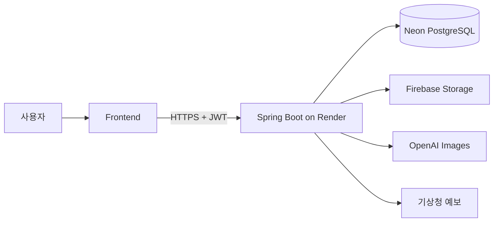

# 👕 Codi-AI

### 내 옷장과 오늘의 상황을 연결하는 AI 스타일링 서비스

Codi-AI는 사용자가 이미 가지고 있는 옷을 활용해 날씨, 일정(TPO), 신체 프로필과 취향에 맞는 코디를 추천합니다. 추천 결과는 빠른 2D 미리보기와 선택형 고품질 AI 렌더로 확인할 수 있습니다.

## 해결하려는 문제

- 매일 반복되는 “오늘 뭐 입지?” 고민
- 날씨와 장소, 활동, 격식을 한 번에 고려하기 어려운 문제
- 보유한 옷은 많지만 조합과 활용 방법을 찾기 어려운 문제
- 온라인 추천이 새 상품 구매 중심이라 실제 내 옷장과 연결되지 않는 문제

## 주요 기능

### 가상 옷장

의류 이미지를 등록하고 카테고리, 색상, 계절, 보온성, 격식, 핏과 기장 정보를 관리합니다. 원본과 파생 이미지는 Firebase Storage에 저장합니다.

### TPO·날씨 기반 추천

자연어 일정을 시간, 장소, 활동, 격식과 분위기로 구조화하고 위치 기반 날씨를 함께 반영해 사용자의 실제 의류만으로 추천 후보를 만듭니다.

### 개인 프로필과 아바타

키, 체형, 성별 표현과 취향을 저장하고 일관된 포즈의 개인 아바타를 생성합니다.

### 가상 착장

빠른 2D 미리보기로 조합을 즉시 비교하고, 선택한 코디는 OpenAI 이미지 모델을 이용해 고품질 착장 결과로 렌더링합니다.

### 즐겨찾기와 피드백

추천 코디를 저장하고 좋아요·별로예요 또는 직접 코디 평가를 남겨 다음 추천에 활용할 수 있습니다.

## 서비스 흐름

```text
회원가입·로그인
→ 신체 프로필과 아바타 설정
→ 보유 의류 이미지 등록
→ 일정과 위치 입력
→ TPO·날씨 분석
→ 내 옷장 기반 코디 추천
→ 2D 미리보기 또는 고품질 AI 렌더
→ 즐겨찾기와 피드백
```

## 기술 스택

| 영역 | 기술 |
| --- | --- |
| Backend | Java 21, Spring Boot 3.3, Spring Security, JWT |
| Database | Neon PostgreSQL, MyBatis, Flyway |
| Storage | Firebase Storage, Firebase Admin SDK |
| AI | OpenAI Images |
| Weather | 기상청 단기예보 API |
| API Docs | Springdoc OpenAPI, Swagger UI |
| Deploy | Docker, Render |

## 아키텍처



## 저장소

| 저장소 | 설명 |
| --- | --- |
| [backend](https://github.com/LPCODI/backend) | Spring Boot REST API와 외부 서비스 연동 |
| [common](https://github.com/LPCODI/common) | 아키텍처, DB, API, 협업 공통 문서 |
| `front` | 프론트엔드 애플리케이션 |

## API

- 운영 서버: <https://backend-s092.onrender.com>
- Swagger UI: <https://backend-s092.onrender.com/swagger-ui/index.html>
- OpenAPI JSON: <https://backend-s092.onrender.com/v3/api-docs>

현재 백엔드는 23개 경로, 34개 API 작업을 제공하며 JWT 인증을 통해 사용자별 데이터를 분리합니다.

---

> Codi-AI의 가상 착장 결과는 스타일과 비율을 비교하기 위한 참고 정보이며 실제 의류의 정확한 사이즈와 착용감을 보장하지 않습니다.
